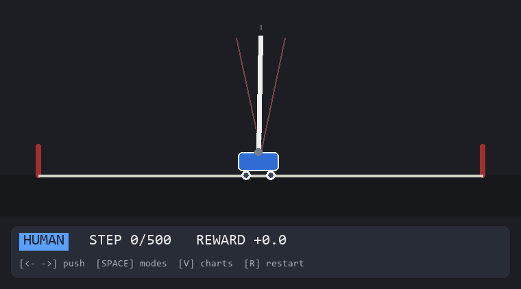
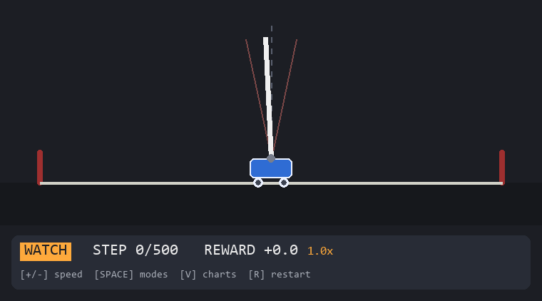
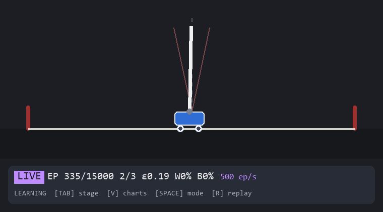
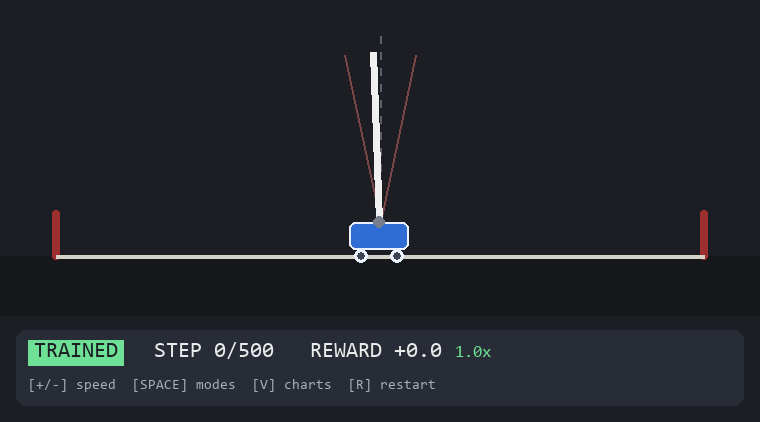
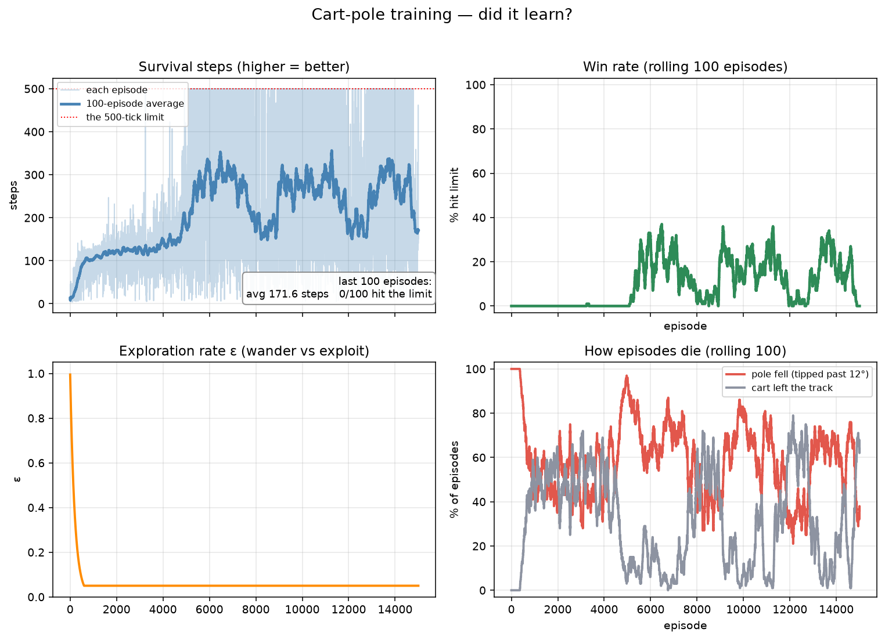
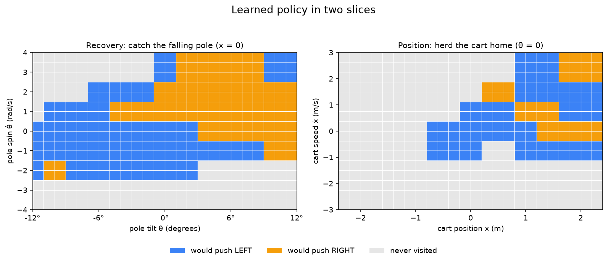

# Project 2 — Cart-Pole Inverted Pendulum

Status: done — environment → agent → train → play → charts → GIFs,
54 checks green.

## The goal

Balance a pole on top of a cart by pushing the cart left or right.
Compared to project 1's maze, everything gets one level harder — and
that's the point:

- **The state is continuous numbers**, not a grid cell: cart position
  `x`, cart speed `ẋ`, pole angle `θ`, pole angular speed `θ̇`. A
  Q-table can't index "position 0.31728…" — I had to learn how to
  turn continuous numbers into something a table can store.
- **The physics happen whether I like it or not**: every step the pole
  falls a little; the agent's only choice is which way to shove the
  cart. The environment comes from Newton's equations, written by me.
- **The reward is almost too simple**: +1 for every step the pole
  stays up. Winning = surviving 500 steps. No pits, no goals — just
  staying alive.

## What I built (the plan, done)

1. ✅ **The world from scratch** — `environment.py`: the pendulum
   equations, `reset() / step(action)`, done when the pole tilts past
   12° or the cart leaves ±2.4 m. Gym-style API, zero dependencies.
2. ✅ **The brain** — `agent.py`: the Q-table I already know, but with
   a *binner* in front of it: four floats → a bucket "zip code".
3. ✅ **The school** — `train.py`: the same ε-greedy loop, now scoring
   "how long did it stay up" — plus three fixes it took before the
   curve actually climbed (below).
4. ✅ **The window** — `play.py`: four modes, a live training
   dashboard, and arrow keys that let me feel the physics myself.
5. ✅ **Tests + charts** — physics checked by hand (one step computed
   with pen and paper), learning curve climbing, and a picture of the
   4D policy cut into two flat slices.

## Important concepts (the new ones this project taught me)

### 1. Continuous state → buckets (the binner)

The maze state was `(row, col)` — two small integers, ready to be a
table index. Cart-pole reports four floats: `(0.0044, 0.2208,
-0.0171, -0.8571)`. A table cannot have a row for every possible
number, so I **bucket** each dimension:

```
(0.0044, 0.2208, -0.0171, -0.8571)  ->  (5, 4, 6, 4)
      |        |        |       |
     mid      mid      mid     mid   = "centered, upright, at rest"
```

My split: 10 × 8 × 12 × 8 = **7,680 rows** instead of infinitely
many. The trade, said out loud so I remember it:

- buckets too **few** → different moments blur together ("leaning 1°
  or 11° is all the same" — disaster)
- buckets too **many** → each row learns from a handful of visits
  (memorizing, not learning)

Two details that cost me debugging time and are now tested:

- **`round()`, not `int()`**: +6° is mathematically the exact bucket
  boundary 9.0, but floats compute 8.999999999999998 — `int()` would
  floor it into the wrong bucket and my hand-math would never match.
- **Out-of-range values clip to the edge bucket**: during its death
  thump a pole can hit 20° — the world may leave the lines I drew,
  the table must not crash.

### 2. Reward design, round two (the plateau bug)

My first trained agents plateaued around ~100 steps and *never*
improved, no matter how long I ran. The reward said +1 per tick alive
— so every tick paid the same, and nothing in the signal ever
screamed at the moment things went wrong. Dying at tick 101 looked
almost as good, downstream, as surviving forever.

The fix: **`FALL_PENALTY = -30.0`, taught on the fatal tick only**.
The brain's *teaching* signal gets a hard slap at the moment of
death, while the history and the charts keep showing the raw +1/tick
score (so the report card stays honest: reward always equals steps).
One number, and the curve started climbing.

### 3. Optimism as exploration (my favorite idea of this project)

The untried action's Q stayed at 0.0 — and in a death zone where
everything is negative-ish, 0.0 *always* wins, so the agent never
tried the other button again. Its first habit became permanent.

The fix: fresh rows start at **`q_init = 50.0`** (half of "perfect
play" for γ=0.99), not 0.0. Every unvisited possibility is *told*
it's great, and reality knocks it down on contact. Optimism is
exploration I don't have to pay for with random moves.

### 4. Training oscillates — so the brain graduates with exams

Run-to-run, the same seed could give 98% wins… or 0%. The *last*
brain of a run is often caught in a dip. So `train.py` now runs a
short **greedy exam** every 500 episodes (`EXAM_EPISODES = 50`, no
learning, no exploration) and keeps the **best exam's scorecard** —
`finish()` saves that diploma instead of whatever brain happened to
exist at the end. Exam scores feed the `B…%` number in LIVE mode's
HUD.

### 5. The physics surprised me (good, that's why it's a project)

Push the cart RIGHT and the pole tips **LEFT** — inertia. I wrote the
equations and still had to see it. The test suite pins the first step
of a RIGHT push to hand-computed numbers:

```
x = 0.00441558,  ẋ = 0.22077922,  θ = -0.01714286,  θ̇ = -0.85714286
```

(from rest, semi-implicit Euler, DT = 0.02 s). If a future me
"improves" a sign, that test screams.

### 6. reward == steps (the simplest report card)

+1 per tick means the episode's total reward IS its length. The HUD
prints both numbers every tick so I can watch them agree — and the
learning curves plot *steps*, because plotting both would draw the
same line twice.

## What's in the project

```
02-cart-pole/
├── environment.py      # THE WORLD: Newton's equations (Gym-style API)
├── agent.py            # THE BRAIN: binner + Q-table + optimism
├── train.py            # THE SCHOOL: shaping, exams, diploma, savings
├── play.py             # THE WINDOW: HUMAN / WATCH / LIVE / TRAINED
├── visualize.py        # THE REPORT CARD: curves + policy slices
├── capture_media.py    # the camera that recorded the GIFs below
├── test_*.py           # 54 checks: every claim above is tested
├── screenshots/        # the GIFs (re-record with: python capture_media.py)
├── charts/             # generated report cards (python visualize.py)
├── q_table.json        # the trained brain   (after python train.py)
└── training_log.json   # the training diary  (after python train.py)
```

## How I run it

```bash
pip install -r requirements.txt

python train.py          # 15,000 episodes in ~23 s, saves the brain
python play.py           # the game window (see below)
python visualize.py      # writes charts/... (or press V inside play.py)

python test_environment.py   # I run these whenever I change something
python test_agent.py
python test_train.py
python test_play.py
python test_visualize.py
```

The official run: **trained in 23.7 s**, best exam at episode 7000
= 98% limit hits / 493 avg steps, and the saved brain reloaded for
greedy play scored **489.9 avg steps / 97% wins**.

## How to play the game

```bash
python play.py
```

| Key            | What it does                                  |
|----------------|-----------------------------------------------|
| **← / →**      | push the cart (only in HUMAN mode)            |
| **SPACE**      | cycle the mode: HUMAN → WATCH → LIVE → TRAINED |
| **+ / −**      | speed up / slow down (WATCH, LIVE & TRAINED)  |
| **TAB**        | skip to the next training stage (LIVE)        |
| **V**          | open the charts of the trained agent          |
| **R**          | restart the episode (replays the demo in LIVE)|
| **ESC / Q**    | quit                                          |

### Mode 1 — HUMAN: feeling the physics

Arrow keys, but here's the twist: **every key press = one physics
tick** (0.02 s) — the world waits for me between presses. Push right
and watch the pole swing left. The little yellow arrow shows which
way I just pushed. This is the fastest way to understand why
balancing is hard *before* asking an agent to learn it.

The GIF below is my recorded run: a simple "push the way it leans"
rule holds for 60 ticks, then I push the wrong way on purpose — and
it dies within six ticks.



### Mode 2 — WATCH: the random agent (the baseline)

A mindless agent picks LEFT/RIGHT at random every tick and dies in
~10–15 ticks. The baseline to beat — seed 30 below: exactly 14
ticks of flailing.



### Mode 3 — LIVE: watching the brain fill itself

A fresh 15,000-episode training session runs behind the window while
the scene **replays the agent's current best greedy episode**
(every other state, so even a 500-tick run stays watchable). The HUD
counts `EP n/15000`, the stage, ε, the rolling win rate **and the
best exam so far (B…%)**. `+ / −` changes training speed (4–500
episodes/second), **TAB** fast-forwards the current stage (and saves
progress at every stage boundary — the brain is never lost mid-run).



Safety net: entering LIVE (or TRAINED, or V) with no `q_table.json`
dumps a warning banner and starts training *automatically* behind it.

### Mode 4 — TRAINED: my graduate

Pure exploitation — `explore=False`, no learning, no random moves.
It plays for as long as it can balance; `time_limit` (surviving all
500 ticks) is the **good** ending and gets a green "SURVIVED ALL
500!" banner, while `pole_fell` / `cart_out` get red ones. The GIF
is the real saved brain going the full distance (seed 9):



| Mode     | Who decides      | What I see                    |
|----------|------------------|-------------------------------|
| HUMAN    | me (←/→)         | the pole swings the "wrong" way |
| WATCH    | `random`         | dead in ~12 ticks             |
| LIVE     | the learner      | ε falling, B% climbing, smarter replays |
| TRAINED  | the Q-table      | 490-tick balance runs         |

## How I check that it actually learned

`python visualize.py` — or **V** inside the window — makes two
charts.

**The learning curves** — steps per episode (higher = better here,
the opposite of project 1's "shortest path" lesson), rolling win
rate, ε decaying, and a fourth panel I added just for this world:
**how episodes die**. Two failure modes tell two different stories —
`cart_out` = "can't steer yet", `pole_fell` = "keeps the cart on
track but lets the pole tip". Which line dominates says what the
brain still gets wrong.



**The policy slices** — the Q-table has four dimensions, so I cut it
into two flat slices (like a CT scan of the policy):

- **Recovery** (cart pinned at x=0): over (tilt, spin) — the heart of
  balancing. The blue/orange split is the decision boundary: lean
  right → push right to run under the falling tip.
- **Position** (pole pinned upright): over (cart position, speed) —
  how the brain herds the cart back to center.

Gray cells = **never visited** during training (the blind spots —
`peek_action` refuses to create optimism rows, or the chart would
lie). Axis ranges come from the *agent's own binner*, so the chart
always shows the world as this brain actually sees it.



## Things that surprised me (my honest notes)

- **The plateau looked exactly like success.** ~100 steps, flat,
  forever. I ran it three times before accepting that "+1 per tick"
  alone was never going to teach urgency. The fix was one number
  (`FALL_PENALTY`), but finding it took chart-reading.
- **Same seed, 98% → 0%.** Training is chaotic. That's *why* the
  diploma system exists — never trust the last brain, trust the best
  exam. The win-rate chart above shows it inside ONE run: the line
  climbs to ~35%, crashes to near 0%, and repeats — five separate
  "it's learning!" moments that were really dips in between.
- **Training scores ≠ greedy scores.** The final 100 *training*
  episodes average ~172 steps / 0 limit hits — because ε = 0.05
  still injects a random push every ~20 ticks, which is fatal at
  400+ steps. The *greedy* evaluation of the same brain: **490 / 97%**.
  Exam time switches exploration off, and that difference is now
  visible in both the HUD and the README.
- **A one-line axis bug shipped a wrong picture.** My first policy
  slice drew the tilt axis in degrees while the brain reads radians —
  every cell probed the wrong bucket. The test comparing axis limits
  to `binner.ranges` caught it immediately. Tests for *charts* matter
  too.
- **The hand-computed first step is the spine of this project.**
  Every physics change has to survive it.

## What I could do next with this project

- **Hyperparameter experiments**: vary alpha/gamma/q_init and compare
  curves — q_init = 0 (textbook ignorance) vs 50 (optimism) is a
  one-line A/B test.
- Then, eventually: **pole on both ends / SwingUp** as a harder
  reward-design puzzle.

---

*This is a learning project. If you're also starting out: build the
world first, break it deliberately, test everything, and watch the
curves — that's where the theory stops being scary.*
