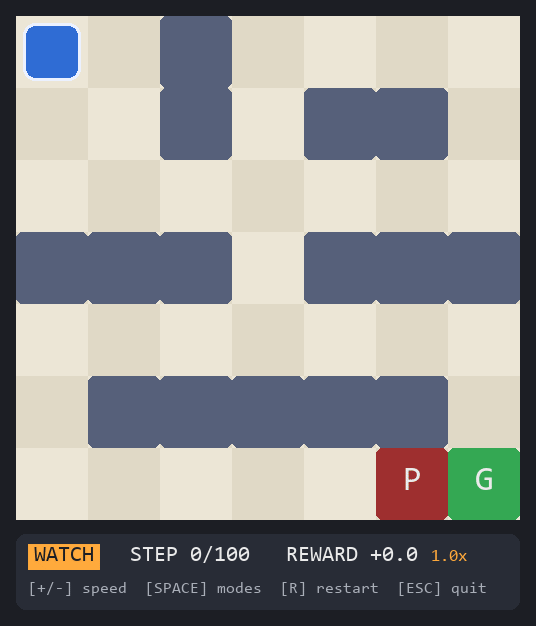
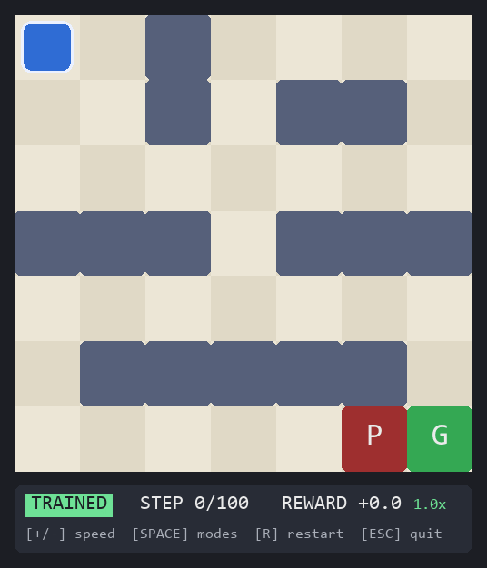
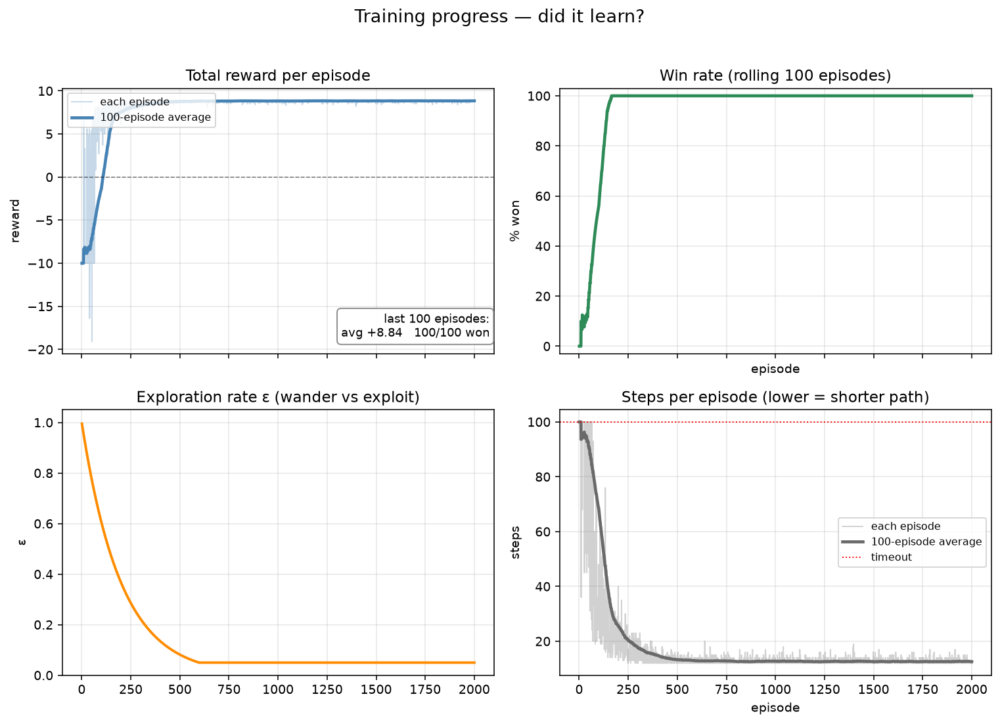
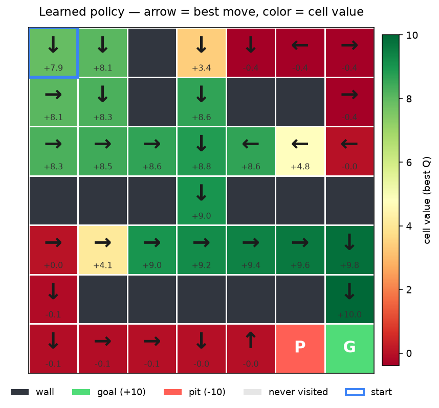

# I'm Learning Reinforcement Learning — One Maze at a Time

> This is my hands-on playground for learning RL fundamentals. I'm a
> beginner writing everything from scratch (no Gym, no Stable-Baselines)
> so that I actually understand each piece. This README is my study
> notes: what I built, what I understood, and how to play with it.


## Why I built this

I kept reading about reinforcement learning and getting lost in the
vocabulary: *policy, value function, Bellman equation, exploration…*
Every tutorial showed me a wall of math, but I learn best by **building
the smallest possible thing myself**.

So my goal for this project was:

1. **Write my own environment** — a tiny 7×7 maze, so the "world" is
   something I can see and reason about.
2. **Write my own agent** — a Q-learning table, ~100 lines, no library
   hides the update rule from me.
3. **Train it and WATCH it learn** — a game window where I can play the
   maze myself, watch a random agent fail, and then watch my trained
   agent win.
4. **Prove it learned** — charts of the training run and a map of what
   the agent believes about every cell.

If you're in the same boat (curious but overwhelmed by RL theory), I
hope building this in order — world → brain → school → window →
report card — gives you the same "oh, THAT's what that means" moments
it gave me.

## The concepts I learned (in my own words)

### 1. The agent–environment loop

Everything in RL is one loop:

```
    AGENT  --acts-->  ENVIRONMENT
      ^                    |
      |--- (next state, reward, done) ---|
```

In my project the **environment** is `environment.py` (the maze, the
walls, the scoring rules) and the **agent** is `agent.py` (the brain).
They only talk through two functions — this is the "Gym API" that every
RL library in the world uses:

```python
state = env.reset()                          # start a new episode
state, reward, done, info = env.step(action)  # take one action
```

The thing that finally clicked for me: **the agent never sees the maze
internals** — it only sees numbers (its position, rewards). The maze
could be anything.

### 2. State, action, reward

- **State** = where I am: just `(row, col)`. My maze is *fully
  observable* — the agent knows everything about its situation.
- **Action** = one of 4 integers: `UP=0, DOWN=1, LEFT=2, RIGHT=3`.
  RL algorithms need numbers, not words like "north".
- **Reward** = the only teaching signal. I chose mine carefully:

| Event      | Reward | Why I picked it            |
|------------|--------|----------------------------|
| Reach goal | **+10** | the big win to chase       |
| Fall in pit| **−10** | the big mistake to avoid   |
| Every step | **−0.1** | a "hurry up" tax, so the agent learns *short* paths, not just any path |
| 100 steps  | timeout | ends hopeless episodes     |

The step penalty was my first real lesson in **reward design**: without
it, the agent happily wanders in circles forever — any path to the goal
is "equally good". With it, the shortest path wins. One number changed
the whole behavior.

### 3. Episodes

One full attempt (start → win/lose/timeout) is an **episode**. Training
= running thousands of episodes. My timeout is 100 steps so that a
hopeless episode can't run forever.

### 4. Q-learning: teaching with a scorecard

This is the core idea I came to build. The agent keeps a **Q-table** —
a scorecard for every (position, action) pair:

```
Q[(2, 3)][DOWN] = 8.2     "moving down from row 2, col 3 is worth ~8.2"
```

Q means *"how much total reward do I expect from here if I take this
move, then play reasonably after?"* After every step, I nudge the score
I just used toward a better estimate — the **temporal-difference
update**:

```
target = r                         if the episode ended here
       = r + gamma * max Q(s', a') if it continues

Q(s, a) += alpha * (target - Q(s, a))
           |_____|    |___________|
           learning    how wrong we were
             rate       (the error we fix)
```

The three knobs I now keep forever:

- **alpha (learning rate, 0.1)** — rewrite 10% toward each new truth.
  Too high = my table flip-flops wildly; too low = I learn in slow motion.
- **gamma (discount, 0.99)** — rewards 12 steps away still count ~89%.
  This is what lets a +10 at the goal teach the move from *ten steps
  back*. Without gamma, learning could never propagate upstream.
- **epsilon (exploration, 1.0 → 0.05)** — see next point.

### 5. Explore vs exploit — my favorite RL concept

Sometimes pick the **current best guess** (exploit), sometimes pick a
**random move** (explore). That's ε-greedy:

- ε = 1.0 at the start: pure wandering — you can't find treasure you
  never stumbled into.
- ε shrinks every episode toward 0.05: mostly exploiting now, but 5%
  silliness forever so the agent never goes fully blind.

**The trap I worried about**: if the agent is never allowed to be dumb,
it explores its first lucky habit and never discovers the better path.

### 6. Training vs evaluating

During training, randomness is *on purpose* (that's exploration) — so
training scores look messy. To see real skill I switch it off
(`explore=False`) and run pure greedy evaluation. That's exactly what
the **TRAINED** mode in the game window does.

### 7. Why I'll need deep RL later (teaser)

My Q-table works because there are only 49 cells. Give this maze 10
million states and the table won't fit in memory — that's when a neural
network replaces the table (Deep Q-Learning). I haven't gone there yet;
this project is the tabular foundation first.

## What's in the project

```
01-gridworld-maze/
├── environment.py      # THE WORLD: maze, moves, rewards (Gym-style API)
├── agent.py            # THE BRAIN: Q-table + ε-greedy + TD update
├── train.py            # THE SCHOOL: fills the Q-table, saves results
├── play.py             # THE WINDOW: pygame, HUMAN / WATCH / TRAINED modes
├── visualize.py        # THE REPORT CARD: learning curves + policy map
├── capture_media.py    # the camera that recorded the GIFs below
├── test_*.py           # 31 checks: every claim above is tested
├── q_table.json        # the trained brain   (after python train.py)
└── training_log.json   # the training diary  (after python train.py)
```

## How I run it

```bash
pip install -r requirements.txt

python train.py          # trains 2000 episodes in ~0.1 s, saves the brain
python play.py           # the game window (see below)
python visualize.py      # writes charts/learning_curves.png + policy_map.png

python test_environment.py   # I run these whenever I change something
python test_agent.py
python test_train.py
python test_play.py
python test_visualize.py
```

Training results **persist**: `train.py` writes `q_table.json` to disk,
so I can close everything and `play.py` still loads the same trained
agent tomorrow.

## How to play the game

```bash
python play.py
```

| Key            | What it does                                  |
|----------------|-----------------------------------------------|
| **Arrow keys** | move (only in HUMAN mode)                     |
| **SPACE**      | cycle the mode: HUMAN → WATCH → TRAINED       |
| **+ / −**      | speed up / slow down (WATCH & TRAINED)        |
| **R**          | restart the episode                           |
| **ESC / Q**    | quit                                          |

### Mode 1 — HUMAN: me against the maze

The badge says **HUMAN**, and I drive with the arrow keys. I play this
first on purpose: feeling how easy it is to bump walls and walk into
the pit makes me appreciate what the agent has to figure out. (Bumping
still costs a step — watch the reward tick down.)


### Mode 2 — WATCH: the random agent (the baseline)

Press SPACE. Now a mindless agent picks a random move every tick — no
thinking, just luck. This is the **baseline to beat**, and the GIF
below is why: after 69 hopeless wanders it falls into the pit (reward
−16.8). Randomness never learns; my rewards show every mistake.



### Mode 3 — TRAINED: my graduate

SPACE again (needs `q_table.json` from `python train.py`, otherwise a
hint banner tells me what to run). The trained agent plays **greedily**
— no random moves, no learning, pure performance. It takes the optimal
12-step route past the pit and wins with +8.9 every single time. The
`+ / −` keys change how fast you watch it.



Side by side, that's the whole story of this project:

| Mode     | Who decides      | Result                |
|----------|------------------|-----------------------|
| HUMAN    | me (arrow keys)  | depends on my day :)  |
| WATCH    | `random`         | −16.8, fell in pit    |
| TRAINED  | the Q-table      | **+8.9, every time**  |

## How I check that it actually learned

`python visualize.py` turns the saved files into two charts.

**The learning curves** — raw episode scores are noisy, so I trust the
bold moving-average line. I look for three things moving together:
reward climbing, win rate reaching 100%, and ε decaying (the handover
from exploring to exploiting). Steps-per-episode dropping shows it
found *shorter* paths, thanks to the −0.1/step tax.



**The policy map** — my favorite picture. Each cell shows the best
arrow Q-learning chose there, colored by how good that cell is (red →
green). The green corridor from the start to the goal *is* the learned
policy; the dark cells are walls, and the red zone around the pit is
the agent's learned fear.



## Things that surprised me (my honest notes)

- **Learning is fast.** ~200 episodes is when it visibly "gets it".
  I expected hours; tabular Q-learning on 49 cells takes 0.1 seconds.
- **The first 100 episodes look hopeless.** Rewards stuck at −10 while
  ε is still high — I almost thought it was broken. The curve said
  otherwise later.
- **Reward design IS the job.** Half my "bugs" were really the
  environment rewarding the wrong thing.
- **The pit is surrounded by red even on cells it never fell from** —
  the fear propagated backwards through γ, exactly like the theory
  says. Seeing the math show up in a picture was the best moment of
  the project.
- **Everything is testable.** 31 checks cover walls, rewards, the TD
  update by hand, ε-greedy, training quality, HUD layout, and charts —
  so when I change a constant, I find out immediately.

## What I want to do next

- **Step 6 — hyperparameter experiments**: vary alpha/gamma/epsilon and
  compare learning curves side by side.
- A **second environment** (maybe a slippery-ice maze) to prove the
  agent doesn't secretly depend on this one maze.
- Then, eventually: **Deep Q-Learning** for something too big for a table.

---

*This is a learning project. If you're also starting out: build the
world first, break it deliberately, test everything, and watch the
curves — that's where the theory stops being scary.*
