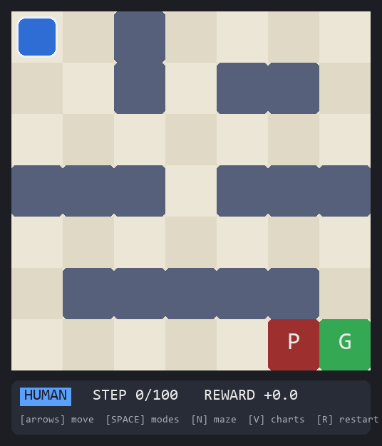

# Reinforcement Learning fundamental projects

As the title suggests this project's purpose is to learn RL, they are a bunch of beginner-friendly projects, starting with the custom grid world maze navigation, then the cart pole inverted pendulum, the lunar lander, classic arcade, Atari Breakout or Pong, and the lastly an algorithmic trading agent. We will start with the first one, custom grid world maze navigation. I have my environment set up as you can see.



## The projects

Every project lives in its own folder with its own README, tests, and
screenshots — this file is just the map.

| # | Project | Status |
|---|---------|--------|
| 01 | [Grid World Maze Navigation](01-gridworld-maze/README.md) | ✅ done |
| 02 | [Cart-Pole Inverted Pendulum](02-cart-pole/README.md) | ✅ done |
| 03 | Lunar Lander | planned |
| 04 | Classic arcade game | planned |
| 05 | Atari (Breakout or Pong) | planned |
| 06 | Algorithmic trading agent | planned |

## How this repo is organized

```
RL fundimentals/
├── README.md             # this map
├── requirements.txt      # shared dependencies (pygame, numpy, matplotlib, pillow)
├── 01-gridworld-maze/    # project 1: environment, agent, training, window, tests
└── 02-cart-pole/         # project 2: the inverted pendulum, built the same way
```

The same recipe builds every project, from scratch — no Gym, no
Stable-Baselines, so every line stays readable:

1. **environment** — the world, with the tiny `reset / step` API
2. **agent** — the brain (a Q-table to start with)
3. **train** — the loop that fills the brain
4. **play** — a window to watch it learn
5. **tests + charts** — proof that it actually learned

```bash
pip install -r requirements.txt   # once, at the top level
```

---

*Build the world first, break it deliberately, test everything, and
watch the curves — that's where the theory stops being scary.*
